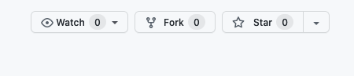

# Free domains for developers

For IT enthusiasts who need a temporary domain name or those who can't or don't want to pay for a top level domain 🌍

Available extensions:

- _your-name_**.cluster.ws**
- _your-name_**.wip.la**

> Note that **.la** and **.ws** are both considered global by Google just like **.com**

## How does it work?

1. [Verify your domain availability](#verify-your-domain-availability)
2. [Add your domain to a DNS provider](#add-your-domain-to-a-dns-provider)
3. [Register your domain with the DNS records given by your provider](#register-a-domain)
4. [After 1 year, it expires, unless you renew it](#renew-your-domain)

### Verify your domain availability

Let's say you want the domain **example.cluster.ws**

#### Option 1

Run the following command:

```sh
nslookup -type=ns example.cluster.ws
```

If you see something like **server can't find example.cluster.ws: NXDOMAIN**, your domain is available.

#### Option 2

Search in the file [zones/cluster.ws.yaml](zones/cluster.ws.yaml) for the term "example" to see if it's already registered

### Add your domain to a DNS provider

Once you settled on available domain, you need to know which DNS servers to use before you can register it. This is why you need to add it to your DNS provider first.

Here are some DNS providers you can use:

| Provider                                                                     | DNS price | Sign-up bonus                                                              | Where to go (after sign-up)                                                                                            |
| ---------------------------------------------------------------------------- | --------- | -------------------------------------------------------------------------- | ---------------------------------------------------------------------------------------------------------------------- |
| [Digital Ocean](https://m.do.co/c/647d31cfbfd7)                              | Free      | [$100](https://m.do.co/c/647d31cfbfd7)                                     | [Networking > Domains](https://cloud.digitalocean.com/networking/domains)                                              |
| [Linode](https://www.linode.com/?r=b1756a97d0b7a32dd4137465808b36d705698cbc) | Free      | [$100](https://www.linode.com/?r=b1756a97d0b7a32dd4137465808b36d705698cbc) | [Domains > Create](https://cloud.linode.com/domains/create)                                                            |
| [Vultr](https://www.vultr.com/?ref=9057126)                                  | Free      | [$100](https://www.vultr.com/?ref=9057126)                                 | [DNS > Add domain](https://my.vultr.com/dns/)                                                                          |
| [ClouDNS](https://www.cloudns.net/aff/id/645892/)                            | Free      | No                                                                         | [DNS Hosting > Create Zone > Master zone](https://www.cloudns.net/main/)                                               |
| [FreeDNS](https://freedns.afraid.org)                                        | Free      | No                                                                         | [Domains > Add A Domain into FreeDNS](https://freedns.afraid.org/domain/add.php)                                       |
| [Hetzner](https://www.hetzner.com/)                                          | Free      | No                                                                         | [DNS > Add zone](https://dns.hetzner.com/add-zone)                                                                     |
| [AWS](https://aws.amazon.com/route53/pricing)                                | Paid      | No                                                                         | [Route 53 > Hosted zones > Create hosted zone](https://console.aws.amazon.com/route53/v2/hostedzones#CreateHostedZone) |
| [Google Cloud](https://cloud.google.com/dns/pricing)                         | Paid      | $300                                                                       | [Cloud DNS > Create a DNS zone](https://console.cloud.google.com/networking/dns/zones/~new)                            |

> Some of the links above are referral links to support this repo

Unfortunately, you cannot use Cloudflare with these domains because they are in fact subdomains and Cloudflare does not support adding a subdomain as a domain.

### Register a domain

Now go to the corresponding zone file for your chosen domain.

For **example.cluster.ws**, edit the zone file [zones/cluster.ws.yaml](zones/cluster.ws.yaml), and follow the format used by the other domains to set the nameservers given by your DNS provider. Open the file on github.dev and add a newline after the comments, and finally register.

### Renew your domain

All domains expire automatically one year **after the last modification**. So, if you want to "renew" your domain, just make a modification to your domain in the zone file. For example, you can add `# renew` at the end of the line, and the year after, modify it to `# renew 2`, and so on.

Only the original committer can renew their domain.

This repo will send 3 reminders (1 month, 1 week and 1 day before expiration) to [your commit email address](https://docs.github.com/en/account-and-profile/setting-up-and-managing-your-github-user-account/managing-email-preferences/setting-your-commit-email-address). If you use a no-reply address and plan to renew your domain, don't forget to add it in your calendar!

### Supporting this repo



### Due diligence

All the code for managing these domains (permissions, validation, etc.) is located in this repo.

We try to keep at least 2 years before the expiration of these domains.

You can check their expiration date from a [whois website](https://www.iana.org/whois) or from your command line:

```sh
whois cluster.ws | grep -i expir
whois wip.la | grep -i expir
```

## Abuse

We're trying to make the world a better place, **please don't abuse this system** 🙏

We reserve the right to cancel any domain and ban any user from using this free service if we think the system is being abused for spam, child pornography, illegal activities, racism, bullying, etc.

**If you think a domain is abusing our system, please [open an issue](https://github.com/Olivr/free-domain/issues)**
